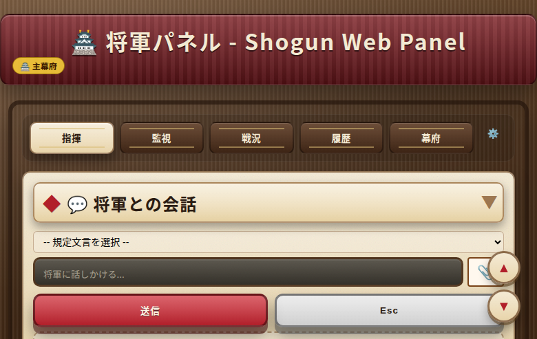
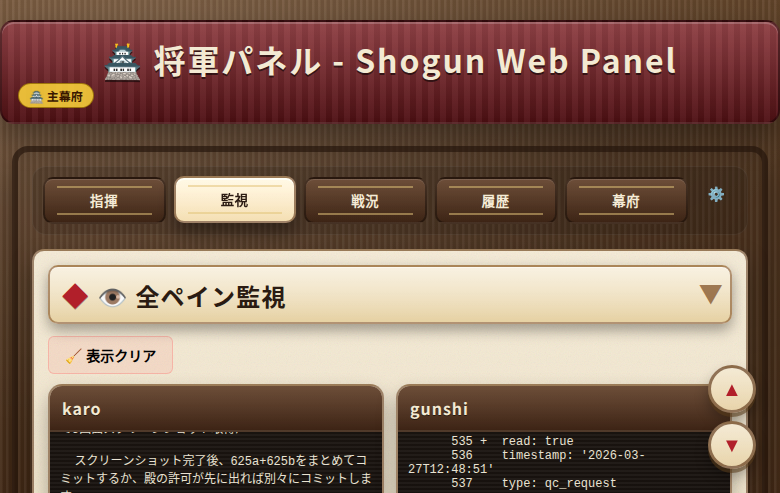
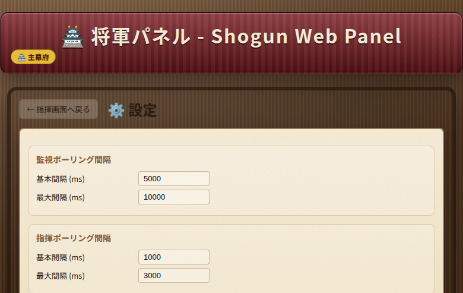
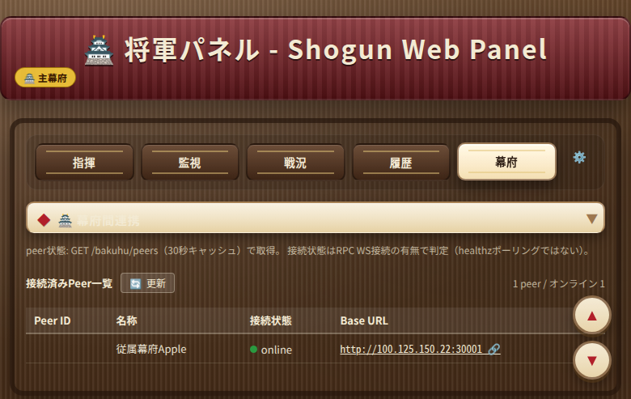

# Shogun Android コンパニオン

[multi-agent-shogun](https://github.com/yohey-w/multi-agent-shogun) のコンパニオンアプリ — スマホからAIエージェント軍団を監視・操作。

<p align="center">
  
  
  
</p>

## 機能

### 4タブ構成

| タブ | 機能 |
|------|------|
| **将軍** | 将軍ペインへのSSHターミナル。テキスト/音声でコマンド送信。ANSI256色対応、特殊キーバー（Enter, C-c, C-b, 矢印, Tab, ESC等） |
| **エージェント** | 9ペイン一覧表示（家老 + 足軽7 + 軍師）。タップで全画面展開。個別エージェントへのコマンド送信 |
| **ダッシュボード** | `dashboard.md` をHTML描画。表のテキスト選択・コピー対応 |
| **設定** | SSH接続設定（ホスト、ポート、ユーザー、鍵/パスワード）、プロジェクトパス、tmuxセッション名 |

### 主要機能

- **音声入力** — 日本語音声認識（連続リスニングモード）。ハンズフリーでコマンド入力
- **BGM** — 戦国テーマBGM 3曲内蔵（shogun / shogun-reiwa / shogun-ashigirls）。タップで曲切替。音声入力中は自動ダッキング
- **レートリミットモニター** — エージェントタブのFABボタンからClaude Max使用量を確認（5h/7dウィンドウ、Sonnet/Opus内訳、セッション/メッセージ数）
- **スクリーンショット共有** — 他アプリの共有メニューからShogunへ直接送信。SFTP転送
- **ANSI カラー対応** — 256色ANSIエスケープコード解析によるターミナル出力描画
- **特殊キーバー** — Enter, C-c, C-b, 矢印, Tab, ESC, C-o, C-d へのクイックアクセス
- **自動リフレッシュ** — 将軍ペイン（3秒）、エージェント一覧（5秒）。SSH一括取得で効率化
- **テキスト選択** — 全画面で長押しによるテキスト選択・コピー対応

<p align="center">
  
  
</p>

## 技術スタック

- **言語**: Kotlin
- **UI**: Jetpack Compose + Material 3
- **SSH**: JSch (mwiede fork) 0.2.21
- **Markdown→HTML**: commonmark-java (GFM tables) → WebView
- **音声**: Android SpeechRecognizer API (ja-JP)
- **Min SDK**: 26 (Android 8.0) / Target: 34

## インストール

[`release/multi-agent-shogun.apk`](release/multi-agent-shogun.apk) からビルド済みAPKをダウンロードしてサイドロード。

またはソースからビルド:

```bash
./gradlew assembleDebug
# APK: app/build/outputs/apk/debug/app-debug.apk
```

## セットアップ

1. アプリを起動 → **設定** タブ
2. SSH接続情報を入力:
   - **ホスト**: サーバーのIP（例: Tailscale IP）
   - **ポート**: 22
   - **ユーザー**: SSHユーザー名
   - **鍵パス** または **パスワード**: 認証方式
   - **プロジェクトパス**: サーバー側のmulti-agent-shogunパス（例: `/mnt/c/tools/multi-agent-shogun`）
   - **セッション名**: 将軍・エージェント用のtmuxセッション名
3. **保存** → **将軍** タブに切替 → 自動接続

### 前提条件

- ホストマシンでSSHサーバーが稼働中
- `shutsujin_departure.sh` でtmuxセッション起動済み
- スマホとサーバー間のネットワーク接続（LAN、Tailscale等）

## アーキテクチャ

```
Android App
    │
    ├── ShogunScreen ──── ShogunViewModel ──┐
    ├── AgentsScreen ──── AgentsViewModel ──┤── SshManager (singleton)
    ├── DashboardScreen ─ DashboardViewModel┤      │
    └── SettingsScreen                      │   JSch SSH
                                            │      │
                                            └──────┤
                                                   ▼
                                            tmux (WSL2/Linux)
                                                   │
                                            ┌──────┴──────┐
                                            │  capture-pane │ (read)
                                            │  send-keys    │ (write)
                                            └──────────────┘
```

## ライセンス

MIT — 親プロジェクトと同じ。
