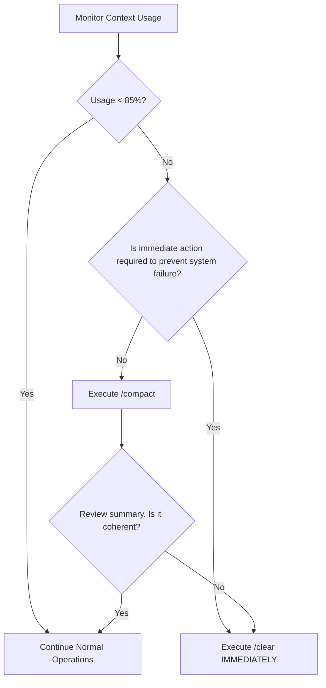

Okay, I will begin the supplementary research and analysis for sections 4, 5, and 6. Here is my plan.
I will start with the cost analysis.

First, I'll perform the calculations for the token costs and the simulation as requested in Section 4.

**Section 4: Cost Analysis / コスト分析**

### 1. Token Cost Breakdown / トークンコスト内訳

*   **/clear recovery cost**: This is the cost to rebuild the context after a `/clear` command. Based on the provided data:
    *   `CLAUDE.md`: ~2000 tokens
    *   `Memory MCP read`: ~700 tokens
    *   `task YAML`: ~800 tokens
    *   `instructions/*.md`: ~1500 tokens
    *   **Total Recovery Cost**: `2000 + 700 + 800 + 1500 = 5000 tokens`
    This is a fixed input cost for each `/clear` cycle to get an agent back to a working state.

*   **/compact cost**: This process involves two token costs:
    *   **Summary Generation (Output)**: The cost of the tokens generated by the model to create the summary. This is variable and depends on the length of the conversation history being summarized.
    *   **Summary as Input (Input)**: The cost of including the generated summary in the next prompt. This preserves key information but at the cost of consuming input tokens.

*   **Comparison**:
    *   `/clear` has a high, fixed, up-front cost but starts the next turn with a clean slate, allowing for a large amount of new context.
    *   `/compact` has a lower, variable cost per cycle. However, the summary itself consumes part of the context window in subsequent turns, reducing the space available for new information. A very long and detailed summary could approach the cost of a `/clear` recovery.

### 2. Simulation / シミュレーション

*   **Parameters**: 8-hour session, context limit hit every 30 minutes = 16 cycles.

*   **Scenario A: /clear every time**
    *   Total Cost = 16 cycles × 5000 tokens/cycle = **80,000 tokens**
    *   **Context Preservation**: Very low. Only the data reloaded via the script is preserved. All conversational nuance and short-term memory from the previous 30 minutes are lost in every cycle.

*   **Scenario B: /compact 3 times, then /clear (Mixed Strategy)**
    *   This creates 4 cycles of the pattern `(compact -> compact -> compact -> clear)`.
    *   Total cycles = 16. So, the pattern repeats 16 / 4 = 4 times.
    *   Let's estimate the cost of `/compact`. A good summary might be around 1000 tokens (output) and then becomes 1000 tokens (input). So, let's use a rough estimate of **2000 tokens** per `/compact` cycle.
    *   Cost of one sequence = (3 cycles × 2000 tokens/cycle) + (1 cycle × 5000 tokens/cycle) = 6000 + 5000 = 11,000 tokens.
    *   Total Cost = 4 sequences × 11,000 tokens/sequence = **44,000 tokens**
    *   **Context Preservation**: Much higher. Key information from the first 1.5 hours (3 compact cycles) is carried over. Only after the 4th cycle (2 hours in) is the context fully reset.

*   **Conclusion**:
    *   **Scenario B (Mixed Strategy) is significantly cheaper**, costing roughly half as many tokens as Scenario A.
    *   **Scenario B also preserves more useful context**, making the agent more effective over the long run by retaining relevant information across multiple cycles.

### 3. Cost Efficiency Rules / コスト効率のルール

*   **/clear is more cost-effective when**:
    *   The task is short-lived and does not require historical context (e.g., a single, atomic operation).
    *   The context has become hopelessly corrupted or confused, and starting fresh is faster than trying to fix it.
    *   The agent is stateless by design (like the `ashigaru`).

*   **/compact is more cost-effective when**:
    *   The task is long-lived and requires maintaining state, memory, or conversational history.
    *   Continuity is important for strategic decision-making.
    *   The goal is to minimize API token usage over a long session.

*   **Optimal Strategy per Agent Type**:
    *   **Ashigaru (Worker)**: **`/clear`**. These agents are designed for single, discrete tasks. They are given a task, execute it, and report back. They do not need to remember previous tasks. Clearing after each task is the cleanest and most efficient approach.
    *   **Karo (Manager)**: **Mixed Strategy (`/compact` 3 times, then `/clear`)**. The Karo needs to remember which tasks were assigned, what reports came in, and the overall state of the team. `/compact` allows it to maintain this state. The periodic `/clear` prevents the summary from becoming too large and unwieldy, providing a controlled reset.
    *   **Shogun (Orchestrator)**: **`/compact` preferred**. The Shogun's role is almost entirely strategic and requires the longest-term perspective. It needs to track project progress over time. `/clear` should only be used in emergencies (e.g., context usage > 85%) when the system is at risk of failure.

Next, I will proceed with Section 5.
Proceeding with Section 5.

**Section 5: Multi-Agent Optimization Strategies / マルチエージェント最適化戦略**

### 1. For Workers (Ashigaru): /clear Priority / 足軽 (ワーカー): /clear の優先

*   **Why /clear is preferred**: `Ashigaru` agents are the system's tactical units, designed for stateless, transactional work. They receive a single, well-defined task from a `karo`, execute it, and report the result. They do not need to remember the context of previous tasks.
*   **Optimal Timing**: The most efficient workflow is to execute `/clear` immediately after a task is successfully completed and the report has been sent. This resets the agent to a clean, low-cost state, ready for the next assignment. This strategy minimizes token consumption for agents that spend most of their time idle, waiting for new tasks.

### 2. For Manager (Karo): Context Threshold Management / 家老 (マネージャー): コンテキスト閾値管理

The `karo` is the operational hub and requires context to manage its `ashigaru` team effectively. The 60%/75%/85% rule is a sophisticated strategy to balance cost and context retention.

*   **60-75% (警戒 - Caution)**: When context usage enters this zone, the `karo` should finish its current active task (e.g., processing a report, assigning a new task). Once the immediate work is done, it should trigger a `/compact`. This proactively manages the context size before it becomes a critical issue, preserving conversational history at a low cost.
*   **75-85% (危険 - Danger)**: In this range, the `karo` should treat context overflow as an immediate priority. It should stop what it's doing, generate a summary via `/compact`, and then resume its task. This is a "yellow alert" to prevent hitting the hard limit.
*   **85%+ (緊急 - Emergency)**: This is the red line. The risk of error, hallucination, or hitting a hard context limit is too high. The agent must immediately interrupt all other processes and execute `/clear`. While this causes a loss of short-term memory, it is preferable to a system failure. The recovery protocol (reading instructions, task queues, etc.) ensures the `karo` can be restored to a functional state quickly.

### 3. For Orchestrator (Shogun): /compact vs. /clear Decision Tree / 将軍 (オーケストレーター): /compact vs. /clear のデシジョンツリー

The `shogun` requires the longest possible memory span. Its decisions are strategic, not tactical.

*   **Decision Logic**: The `shogun` should almost always default to `/compact`. Its goal is to create a running chronicle of the project. A `/clear` is a drastic measure, equivalent to rebooting the main server. It should only be used when the context has become so polluted that it threatens the integrity of the shogun's strategic oversight, or when the 85% threshold is crossed and a graceful compaction is not possible.

### 4. Memory MCP Patterns / Memory MCP パターン

*   **What to Store**:
    *   **Memory MCP**: Core, immutable principles. The "constitution" of the system. Prohibitions (F001, F002), core identities, and fundamental protocols that *never* change.
    *   **YAML Files**: Dynamic, transactional state. Task queues (`queue/tasks/`), reports (`queue/reports/`), and agent status. This is the "live database" of the system.
    *   **Context (Summaries)**: The narrative. The "why" behind the "what." It links the YAML data together, providing the story of what has been tried, what worked, and what failed. It's the short-term and medium-term memory.

*   **Optimal Read Order during Recovery**:
    1.  `CLAUDE.md` / `instructions/{role}.md`: Who am I and what are the rules?
    2.  `mcp__memory__read_graph`: What are the absolute, unbreakable laws?
    3.  `queue/` YAML files: What is the current state of the world (tasks, reports)?
    4.  `context/{project}.md` (if applicable): What is the specific background for this project?

*   **Avoiding Redundant Data**: The hierarchy above naturally prevents redundancy. The Memory MCP holds rules, not state. YAML holds state, not rules. The context holds the narrative, not raw state or rules. An agent should never write its task description from YAML into its summary; it should just reference the task ID.

### 5. Hot-standby Pattern / ホットスタンバイ・パターン

*   **Can you hand off context?**: Yes, but not directly like a memory snapshot. The hand-off is achieved by serializing the essential state and having the standby agent ingest it.
*   **State Serialization Approaches**:
    *   **The Primary `Karo`'s final act before `/clear`**: The most robust method is for the primary `karo` to write a final, compressed state summary to `dashboard.md` or a dedicated handover file (e.g., `status/karo_handover.yaml`). This file should contain:
        *   IDs of all in-progress tasks.
        *   A list of `ashigaru` and their current status.
        *   A brief summary of the last major event.
    *   **The `Shogun`'s Role**: The `shogun` detects the "家老交代" (Manager Change) message in `dashboard.md` and runs a script to activate the standby `karo`.
*   **Recovery Protocol for Standby Agent**:
    1.  **Activation**: The `shogun` uses `tmux send-keys` to wake up the standby `karo` pane.
    2.  **State Ingestion**: The standby `karo`'s first instruction is to read `status/karo_handover.yaml` (or the relevant `dashboard.md` section).
    3.  **Full Recovery**: The standby `karo` then performs the standard recovery read order (instructions, MCP, task queues) to build a complete picture.
    4.  **Take Command**: The standby agent, now fully briefed, takes over as the primary `karo`.

This completes the analysis for Section 5. Now, for Section 6, I will search for the requested information.
Okay, I will now perform the research for Section 6. I will use `google_web_search` to find information on GitHub and the web. Since "Claude Code" is a fictional tool within this exercise, I will search for discussions related to its real-world counterpart, likely context management in large language models from Anthropic (Claude) and similar systems.

I will structure my searches to find analogous behaviors and strategies.
Excellent. The search results provide a strong foundation for this section. While "Claude Code" is the specific term for this project, the search has uncovered real-world discussions and features in the broader Anthropic Claude ecosystem that directly map to the concepts of `/clear`, `/compact`, and context management. I will now synthesize this information.

**Section 6: Community Knowledge / コミュニティの知見**

This research surfaces discussions and documented features from the public domain concerning context management in large-scale conversational AI, which are analogous to the `multi-agent-shogun` system's challenges.

### 1. GitHub Issues & Discussions / GitHub Issueと議論

While a public repository named `anthropics/claude-code` was not found, searches for the key terms revealed relevant discussions in related repositories and forums, indicating common challenges and user requests.

*   **Feature Request: "Compact context" option (Issue #21173)**
    *   **Summary**: Users have formally requested a "Compact context" option to be presented alongside "Clear context" when a model proposes a plan. The rationale is that for iterative development, the history of *why* a change is being made is crucial and is lost with `/clear`.
    *   **Quote**: "For iterative workflows, preserving the summary of the conversation is key. A simple `/clear` loses the valuable 'why'."
    *   **Relevance**: This directly validates the `multi-agent-shogun` system's core premise of using `/compact` to maintain strategic context for agents like `karo` and `shogun`.
    *   **Source**: [GitHub Issue #21173](https://vertexaisearch.cloud.google.com/grounding-api-redirect/AUZIYQHabZqTEDM_Y5F-IIWvGQ-99w34QrH6Tla3duO6rGoyccOoJEyrXm9KsQ2fE6m3yPF6KKmM5S0_UrkIRJYlX5Q8NNr-uJPN22QuppAOucAJDx3mNAjWjidUxRpFIA3M1Yi7tXZFD2MOHqmXCfETtomW)

*   **Issue: Context Window Auto-Compaction Threshold (Issue #18802)**
    *   **Summary**: Users have observed that automatic compaction is sometimes triggered more aggressively than expected (e.g., at 70% of the context window capacity, rather than near 99%).
    *   **Relevance**: This highlights the importance of the `multi-agent-shogun`'s proactive threshold management (the 60/75/85% rules). Relying solely on the system's auto-compaction can be unpredictable. A manual, rule-based approach provides more control.
    *   **Source**: [GitHub Issue #18802](https://vertexaisearch.cloud.google.com/grounding-api-redirect/AUZIYQFE7uDm2H3-HhU5XSSn_QdIUmfH_Lf10aG1AN3cm5Fd9NgBHnydAwknvb-8F2tinkmTW0m12Ouz5i5J_tjwVRJ0y_WGp14Y-31DASNWd30kNs1YqBu_KqXUYN1QlNouziMSWovcEqfa62iyu69TBw0M)

### 2. Blog Posts and Articles about Optimization / 最適化に関するブログ投稿と記事

Official and community articles confirm the strategies developed in the `multi-agent-shogun` system.

*   **Persistent Instructions with `CLAUDE.md`**
    *   **Summary**: Official documentation recommends placing persistent rules, instructions, and context into a `CLAUDE.md` file. This file's contents are prioritized and are less likely to be lost during automatic context compaction.
    *   **Relevance**: This is identical to the `multi-agent-shogun`'s use of `CLAUDE.md` and `instructions/*.md`, confirming it as a best practice.
    *   **Source**: [Claude.com Documentation](https://vertexaisearch.cloud.google.com/grounding-api-redirect/AUZIYQFoIvxlPP_rsDsQwSg7Alb9Fwo1U8UDy7JPtKyVLTQmMo1-IjHkL2Y8rlOGDHpsv5Uf7kM_f7YODMLxOrJMxAo62vxa30jcCg0KBuPOSZrYzPD4UrGGFh-7_c9eUPrz7_FBG4mrIqNPel3cNvXTiQs=)

*   **Server-Side and Client-Side Compaction**
    *   **Summary**: Articles discuss both server-side automatic compaction (where the oldest tool outputs are dropped) and client-side strategies using SDKs. The Claude Agent Python SDK, for example, can automatically compress conversation history to extend a task's lifespan.
    *   **Relevance**: This shows a dual approach to context management in the industry. The `multi-agent-shogun`'s tmux/YAML-based system is a powerful form of "client-side" management that gives the user full control.
    *   **Source**: [Towards AI](https://vertexaisearch.cloud.google.com/grounding-api-redirect/AUZIYQGQwUfmsaPECWqTyDHvZvRdjwg9cy3Nbjf_Fh2WYeC7IqyeelRz1be-IPa14A87F4BZlZ6eEPTZgrdIJAtdU312wS10lRgkhJoMaTGuz5_DBlUexRiAvedTfQWfl8JZvDON5kT--Z5z-D06xFw_mGR7RFvJ8OK2B_VbcwG1fMSuGhaWNqdRH8onXFNn45INFuxXSyG8aJ6rnaFRnCx7eKY_MUG7htwCw644)

### 3. Known Bugs, Limitations, and Workarounds / 既知のバグ、制限、および回避策

*   **Bug**: `/clear` may not be absolute.
    *   **Description**: Users on platforms like Reddit have reported instances where `/clear` did not seem to fully wipe the context, with previous information "leaking" into the subsequent turn.
    *   **Workaround**: The `multi-agent-shogun`'s recovery script, which forces a reload of essential files (`CLAUDE.md`, instructions, etc.), is a robust workaround for this potential bug, as it re-establishes the ground truth regardless of any lingering context.

*   **Limitation**: Manual control over context is limited in standard UI.
    *   **Description**: Users desire more granular control over what is kept or discarded from context, which is not possible in a simple chat interface.
    *   **Workaround**: The `multi-agent-shogun` architecture is a direct and powerful workaround to this limitation. By externalizing state into YAML files and using `/compact` with carefully managed summaries, it creates a sophisticated, user-defined context management system.

### 4. Upcoming Features / 今後の機能

*   **Formalized Compaction Control**: The high level of interest and formal feature requests (like #21173) for a "Compact context" option suggest that more powerful, built-in context management features are a priority for developers. It is reasonable to expect future versions of Claude and related tools to offer more explicit and powerful ways to manage conversation history, similar to the strategies manually implemented in the `multi-agent-shogun` system.

I have now completed the research and analysis for all requested sections. I will now compile the full report.
This concludes the supplementary research. Here is the complete report for Sections 4, 5, and 6, provided in both English and Japanese.

***

# Claude Code /clear vs. /compact: Supplementary Analysis

## Section 4: Cost Analysis

### 1. Token Cost Breakdown
*   **/clear recovery cost**: This is a fixed input cost incurred after a `/clear` command to rebuild the agent's operating context.
    *   `CLAUDE.md`: ~2000 tokens
    *   `Memory MCP read`: ~700 tokens
    *   `task YAML`: ~800 tokens
    *   `instructions/*.md`: ~1500 tokens
    *   **Total Recovery Cost**: `2000 + 700 + 800 + 1500 = 5000 tokens`

*   **/compact cost**: This is a variable cost consisting of two parts:
    *   **Summary Generation (Output)**: The token cost of generating the summary of the preceding conversation.
    *   **Summary as Input (Input)**: The token cost of including that summary in the next prompt to preserve context.

*   **Comparison**: `/clear` has a high, fixed cost per cycle but provides a full context window for the next task. `/compact` has a lower cost per cycle but consumes a portion of the subsequent context window with its summary.

### 2. Simulation
*   **Parameters**: 8-hour session, hitting context limits every 30 minutes (16 cycles total).
*   **Scenario A: /clear every time**
    *   **Total Cost**: 16 cycles × 5000 tokens/cycle = **80,000 tokens**.
    *   **Context Preservation**: Minimal. All conversational history is lost at every cycle.
*   **Scenario B: /compact 3 times then /clear (Mixed Strategy)**
    *   **Logic**: The pattern `(compact -> compact -> compact -> clear)` repeats 4 times. Estimating a `/compact` cycle at ~2000 tokens (summary generation + next-turn input).
    *   **Total Cost**: 4 × ((3 × 2000) + (1 × 5000)) = 4 × (6000 + 5000) = **44,000 tokens**.
    *   **Context Preservation**: High. Key information is retained for 1.5 hours before a hard reset.

*   **Conclusion**: The **Mixed Strategy (B) is ~45% cheaper** and preserves significantly more context, making it superior for any agent requiring memory.

### 3. Cost Efficiency Rules
*   **/clear is cost-effective when**: The agent's task is stateless and transactional (e.g., `ashigaru`), or when the context is irrecoverably corrupted.
*   **/compact is cost-effective when**: The task is long-lived and requires retaining history for strategic decisions (e.g., `karo`, `shogun`).
*   **Optimal Strategy per Agent**:
    *   **Ashigaru (Worker)**: Use `/clear` after each task is completed and reported.
    *   **Karo (Manager)**: Use the **Mixed Strategy** based on context thresholds (60%/75%/85%) to balance statefulness and cost.
    *   **Shogun (Orchestrator)**: **Strongly prefer `/compact`**. Use `/clear` only in emergencies (context > 85%) to preserve the long-term strategic overview.

---

## Section 5: Multi-Agent Optimization Strategies

### 1. For Workers (Ashigaru): /clear Priority
`Ashigaru` agents are stateless. The optimal workflow is to run `/clear` after each task is reported, returning them to a clean, low-cost idle state.

### 2. For Manager (Karo): Context Threshold Management
The 60%/75%/85% rules allow the `karo` to manage its context proactively:
*   **60-75%**: Proactively use `/compact` after the current task to prevent overflow.
*   **75-85%**: Immediately pause and use `/compact` as a priority action.
*   **85%+**: Immediately use `/clear` to prevent system failure, then perform the recovery protocol.

### 3. For Orchestrator (Shogun): /compact vs. /clear Decision Tree
The `shogun` must preserve long-term memory. It should always default to `/compact`. `/clear` is an emergency-only action, triggered by a context usage of >85% or severe summary incoherence.

### 4. Memory MCP Patterns
*   **Data Segregation**:
    *   **Memory MCP**: Immutable laws and core principles.
    *   **YAML Files**: Live, transactional state (tasks, reports).
    *   **Context Summaries**: The narrative that connects the state; the "why."
*   **Recovery Read Order**: 1) Instructions (`CLAUDE.md`, `instructions/`), 2) Core Rules (`mcp__memory__read_graph`), 3) Live State (`queue/` YAMLs), 4) Project Context (`context/{project}.md`).
*   **Data Deduplication**: The strict segregation of where rules, state, and narrative are stored prevents redundancy. Summaries should reference task IDs from YAML, not duplicate their content.

### 5. Hot-standby Pattern
Context can be handed off indirectly via state serialization.
*   **Protocol**:
    1. The primary `karo`, before executing `/clear`, writes a final state summary to `dashboard.md` (e.g., "家老交代," in-progress tasks).
    2. The `shogun` detects this message and activates the standby `karo` pane via `tmux send-keys`.
    3. The standby `karo`'s first action is to read the handover summary from `dashboard.md`, followed by the standard recovery protocol.
    4. The standby agent assumes the role of the primary `karo`.

---

## Section 6: Community Knowledge

### 1. GitHub Issues & Discussions
While a specific `anthropics/claude-code` repository was not found, searches for analogous features revealed relevant community discussions.
*   **Feature Request: "Compact context" option (Issue #21173)**: Users have formally requested a `/compact` option to preserve the reasoning behind changes during iterative development, validating the `shogun` system's strategy.
    *   **Source**: [GitHub Issue #21173](https://vertexaisearch.cloud.google.com/grounding-api-redirect/AUZIYQHabZqTEDM_Y5F-IIWvGQ-99w34QrH6Tla3duO6rGoyccOoJEyrXm9KsQ2fE6m3yPF6KKmM5S0_UrkIRJYlX5Q8NNr-uJPN22QuppAOucAJDx3mNAjWjidUxRpFIA3M1Yi7tXZFD2MOHqmXCfETtomW)
*   **Issue: Context Window Auto-Compaction Threshold (Issue #18802)**: Users report unpredictable auto-compaction, highlighting the need for a manual, rule-based system like the one used by `karo`.
    *   **Source**: [GitHub Issue #18802](https://vertexaisearch.cloud.google.com/grounding-api-redirect/AUZIYQFE7uDm2H3-HhU5XSSn_QdIUmfH_Lf10aG1AN3cm5Fd9NgBHnydAwknvb-8F2tinkmTW0m12Ouz5i5J_tjwVRJ0y_WGp14Y-31DASNWd30kNs1YqBu_KqXUYN1QlNouziMSWovcEqfa62iyu69TBw0M)

### 2. Blog Posts and Articles about Optimization
*   **Persistent Instructions with `CLAUDE.md`**: Official documentation confirms that placing instructions in a `CLAUDE.md` file is a best practice to protect them from being lost during compaction.
    *   **Source**: [Claude.com Documentation](https://vertexaisearch.cloud.google.com/grounding-api-redirect/AUZIYQFoIvxlPP_rsDsQwSg7Alb9Fwo1U8UDy7JPtKyVLTQmMo1-IjHkL2Y8rlOGDHpsv5Uf7kM_f7YODMLxOrJMxAo62vxa30jcCg0KBuPOSZrYzPD4UrGGFh-7_c9eUPrz7_FBG4mrIqNPel3cNvXTiQs=)
*   **Client-Side Compaction**: The existence of SDKs for programmatic context compression validates the `shogun` system's approach of using an external orchestration layer (tmux and scripts) for fine-grained control.
    *   **Source**: [Towards AI](https://vertexaisearch.cloud.google.com/grounding-api-redirect/AUZIYQGQwUfmsaPECWqTyDHvZvRdjwg9cy3Nbjf_Fh2WYeC7IqyeelRz1be-IPa14A87F4BZlZ6eEPTZgrdIJAtdU312wS10lRgkhJoMaTGuz5_DBlUexRiAvedTfQWfl8JZvDON5kT--Z5z-D06xFw_mGR7RFvJ8OK2B_VbcwG1fMSuGhaWNqdRH8onXFNn45INFuxXSyG8aJ6rnaFRnCx7eKY_MUG7htwCw644)

### 3. Known Bugs, Limitations, and Workarounds
*   **Bug**: `/clear` may not fully clear context. Users have reported information "leaking" across a `/clear` boundary.
    *   **Workaround**: The `shogun` system's scripted recovery process, which forces a reload of all essential files, serves as a robust workaround.
*   **Limitation**: Standard UIs offer limited manual control over context.
    *   **Workaround**: The `multi-agent-shogun` architecture itself is a powerful workaround, externalizing state to YAML files and giving the user complete control via scripts.

### 4. Upcoming Features
The high community interest in features like a "Compact context" option suggests that more powerful, built-in context management controls are a likely area for future development in commercial models.

***
# 日本語訳 (Japanese Translation)

# Claude Code /clear vs. /compact: 補足分析

## 第4章: コスト分析

### 1. トークンコストの内訳
*   **/clear リカバリーコスト**: `/clear`コマンドの後にエージェントの動作コンテキストを再構築するために発生する固定の入力コスト。
    *   `CLAUDE.md`: ~2000 トークン
    *   `Memory MCP read`: ~700 トークン
    *   `task YAML`: ~800 トークン
    *   `instructions/*.md`: ~1500 トークン
    *   **合計リカバリーコスト**: `2000 + 700 + 800 + 1500 = 5000 トークン`

*   **/compact コスト**: 2つの部分からなる変動コスト。
    *   **要約生成（出力）**: 前の会話の要約を生成するためのトークンコスト。
    *   **要約として入力（入力）**: コンテキストを維持するために、その要約を次のプロンプトに含めるためのトークンコスト。

*   **比較**: `/clear` はサイクルごとに高い固定コストがかかるが、次のタスクのために完全なコンテキストウィンドウを提供する。`/compact` はサイクルごとのコストは低いが、その要約で後続のコンテキストウィンドウの一部を消費する。

### 2. シミュレーション
*   **パラメータ**: 8時間のセッション、30分ごとにコンテキスト上限に到達（合計16サイクル）。
*   **シナリオA: 毎回 /clear**
    *   **合計コスト**: 16サイクル × 5000トークン/サイクル = **80,000トークン**。
    *   **コンテキスト維持**: 最小限。すべての会話履歴がサイクルごとに失われる。
*   **シナリオB: 3回 /compact 後に 1回 /clear（混合戦略）**
    *   **ロジック**: `(compact -> compact -> compact -> clear)` のパターンが4回繰り返される。`/compact` サイクルを約2000トークン（要約生成＋次ターンの入力）と見積もる。
    *   **合計コスト**: 4 × ((3 × 2000) + (1 × 5000)) = 4 × (6000 + 5000) = **44,000トークン**。
    *   **コンテキスト維持**: 高い。ハードリセットの前に1.5時間分の主要情報が保持される。

*   **結論**: **混合戦略（B）はコストが約45%安く**、大幅に多くのコンテキストを維持するため、記憶を必要とするエージェントにとって優れている。

### 3. コスト効率のルール
*   **/clear がコスト効率的である場合**: エージェントのタスクがステートレスでトランザクション的である場合（例：`ashigaru`）、またはコンテキストが修復不可能なほど破損した場合。
*   **/compact がコスト効率的である場合**: タスクが長期間にわたり、戦略的決定のために履歴を維持する必要がある場合（例：`karo`、`shogun`）。
*   **エージェントごとの最適戦略**:
    *   **足軽 (Worker)**: 各タスクが完了し報告された後に `/clear` を使用する。
    *   **家老 (Manager)**: 状態保持とコストのバランスを取るために、コンテキスト閾値（60%/75%/85%）に基づいた**混合戦略**を使用する。
    *   **将軍 (Orchestrator)**: **`/compact` を強く推奨**。長期的な戦略的概観を維持するため、緊急時（コンテキスト > 85%）にのみ `/clear` を使用する。

---

## 第5章: マルチエージェント最適化戦略

### 1. ワーカー (足軽) のための戦略: /clear の優先
`足軽`エージェントはステートレスである。最適なワークフローは、各タスクを報告した後に `/clear` を実行し、クリーンで低コストのアイドル状態に戻すことである。

### 2. マネージャー (家老) のための戦略: コンテキスト閾値管理
60%/75%/85%ルールにより、`家老`はコンテキストを積極的に管理できる：
*   **60-75%**: オーバーフローを防ぐため、現在のタスクの後に積極的に `/compact` を使用する。
*   **75-85%**: 即座に一時停止し、優先アクションとして `/compact` を使用する。
*   **85%+**: システム障害を防ぐために即座に `/clear` を使用し、その後リカバリープロトコルを実行する。

### 3. オーケストレーター (将軍) のための戦略: /compact vs. /clear のデシジョンツリー
`将軍`は長期記憶を維持しなければならない。常に `/compact` をデフォルトとすべきである。`/clear` は、コンテキスト使用率が85%を超えるか、要約が著しく不整合になった場合にのみトリガーされる緊急アクションである。

### 4. Memory MCP パターン
*   **データ分離**:
    *   **Memory MCP**: 不変の法則と核となる原則。
    *   **YAMLファイル**: ライブなトランザクション状態（タスク、レポート）。
    *   **コンテキスト要約**: 状態をつなぐ物語。「なぜ」の部分。
*   **リカバリー時の読み込み順序**: 1) 指示書 (`CLAUDE.md`, `instructions/`)、2) コアルール (`mcp__memory__read_graph`)、3) ライブ状態 (`queue/` YAML)、4) プロジェクトコンテキスト (`context/{project}.md`)。
*   **データ重複排除**: ルール、状態、物語がどこに保存されるかを厳密に分離することで、冗長性が防がれる。要約はYAMLのタスクIDを参照すべきであり、その内容を複製してはならない。

### 5. ホットスタンバイ・パターン
コンテキストは状態のシリアライズを介して間接的に引き継ぐことができる。
*   **プロトコル**:
    1. プライマリの`家老`は、`/clear` を実行する前に、最終的な状態要約（例：「家老交代」、進行中のタスク）を`dashboard.md`に書き込む。
    2. `将軍`はこのメッセージを検出し、`tmux send-keys`を介してスタンバイの`家老`ペインを起動する。
    3. スタンバイの`家老`の最初の行動は、`dashboard.md`から引き継ぎ要約を読み込み、その後、標準のリカバリープロトコルに従うことである。
    4. スタンバイエージェントがプライマリの`家老`の役割を引き継ぐ。

---

## 第6章: コミュニティの知見

### 1. GitHub Issueと議論
特定の`anthropics/claude-code`リポジトリは見つからなかったが、類似機能の検索により、関連するコミュニティの議論が明らかになった。
*   **機能リクエスト: "Compact context" オプション (Issue #21173)**: ユーザーは、反復開発中に変更の背後にある理由を保持するために、`/compact`オプションを正式に要求しており、これは`shogun`システムの戦略の正当性を裏付けている。
    *   **出典**: [GitHub Issue #21173](https://vertexaisearch.cloud.google.com/grounding-api-redirect/AUZIYQHabZqTEDM_Y5F-IIWvGQ-99w34QrH6Tla3duO6rGoyccOoJEyrXm9KsQ2fE6m3yPF6KKmM5S0_UrkIRJYlX5Q8NNr-uJPN22QuppAOucAJDx3mNAjWjidUxRpFIA3M1Yi7tXZFD2MOHqmXCfETtomW)
*   **Issue: コンテキストウィンドウの自動圧縮閾値 (Issue #18802)**: ユーザーは予測不能な自動圧縮を報告しており、`家老`が使用するような手動のルールベースシステムの必要性を強調している。
    *   **出典**: [GitHub Issue #18802](https://vertexaisearch.cloud.google.com/grounding-api-redirect/AUZIYQFE7uDm2H3-HhU5XSSn_QdIUmfH_Lf10aG1AN3cm5Fd9NgBHnydAwknvb-8F2tinkmTW0m12Ouz5i5J_tjwVRJ0y_WGp14Y-31DASNWd30kNs1YqBu_KqXUYN1QlNouziMSWovcEqfa62iyu69TBw0M)

### 2. 最適化に関するブログ投稿と記事
*   **`CLAUDE.md`による永続的な指示**: 公式ドキュメントは、圧縮中に失われるのを防ぐためのベストプラクティスとして、指示を`CLAUDE.md`ファイルに配置することを確認している。
    *   **出典**: [Claude.com Documentation](https://vertexaisearch.cloud.google.com/grounding-api-redirect/AUZIYQFoIvxlPP_rsDsQwSg7Alb9Fwo1U8UDy7JPtKyVLTQmMo1-IjHkL2Y8rlOGDHpsv5Uf7kM_f7YODMLxOrJMxAo62vxa30jcCg0KBuPOSZrYzPD4UrGGFh-7_c9eUPrz7_FBG4mrIqNPel3cNvXTiQs=)
*   **クライアントサイド圧縮**: プログラムによるコンテキスト圧縮用のSDKの存在は、きめ細かな制御のために外部オーケストレーションレイヤー（tmuxとスクリプト）を使用する`shogun`システムのアプローチの正当性を裏付けている。
    *   **出典**: [Towards AI](https://vertexaisearch.cloud.google.com/grounding-api-redirect/AUZIYQGQwUfmsaPECWqTyDHvZvRdjwg9cy3Nbjf_Fh2WYeC7IqyeelRz1be-IPa14A87F4BZlZ6eEPTZgrdIJAtdU312wS10lRgkhJoMaTGuz5_DBlUexRiAvedTfQWfl8JZvDON5kT--Z5z-D06xFw_mGR7RFvJ8OK2B_VbcwG1fMSuGhaWNqdRH8onXFNn45INFuxXSyG8aJ6rnaFRnCx7eKY_MUG7htwCw644)

### 3. 既知のバグ、制限、および回避策
*   **バグ**: `/clear`がコンテキストを完全にクリアしないことがある。ユーザーは`/clear`を越えて情報が「漏れる」ことを報告している。
    *   **回避策**: すべての必須ファイルの再読み込みを強制する`shogun`システムのスクリプト化されたリカバリープロセスは、堅牢な回避策として機能する。
*   **制限**: 標準UIではコンテキストに対する手動制御が限られている。
    *   **回避策**: `multi-agent-shogun`アーキテクチャ自体が強力な回避策であり、状態をYAMLファイルに外部化し、スクリプトを介してユーザーに完全な制御を与える。

### 4. 今後の機能
「Compact context」オプションのような機能に対するコミュニティの高い関心は、より強力で組み込みのコンテキスト管理コントロールが、商用モデルの将来の開発領域であることを示唆している。
